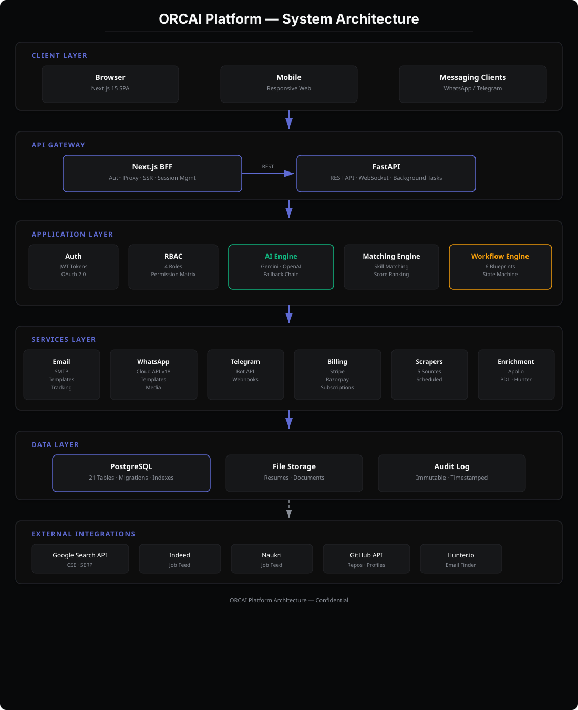
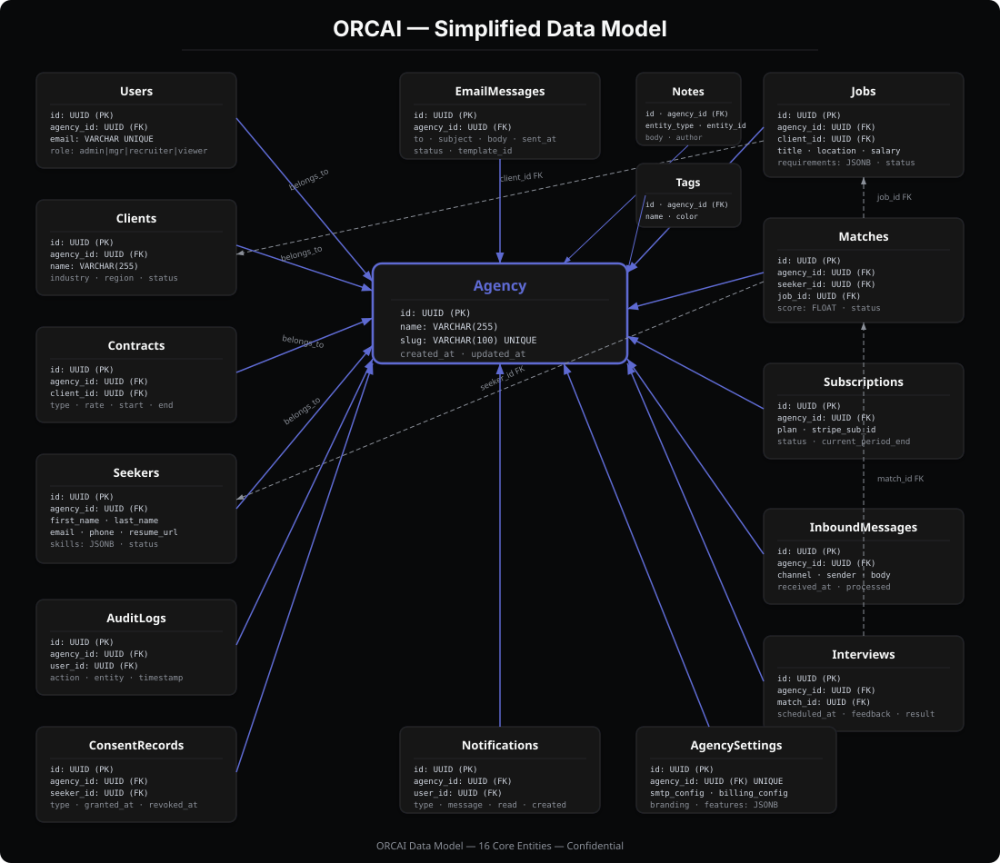

# ORCAI — AI-First Recruiting Platform

> **Intelligent talent matchmaking for staffing agencies** — aggregates candidate pipelines, parses contracts with AI, scores matches with weighted algorithms, and routes every decision through a human-in-the-loop confidence gate. Fully compliant with DPDPA-2023, US I-9 / E-Verify requirements, and built for Indian staffing agencies operating in the US market.

[](#testing)
[](#license)
[](#)

---

### Key Highlights

| | | |
|---|---|---|
| **AI-Powered Matching** | **Multi-Workflow Pipelines** | **Compliance-First** |
| Weighted scoring engine with Gemini / OpenAI integration and deterministic offline fallback. Confidence-gated HITL ensures no candidate moves forward without recruiter approval when scores are borderline. | 6 configurable workflow blueprints — Domestic IT, US Bench Sales, RPO, In-house, Campus, and Executive Search — each with unique stages, entry/fill/reject logic, and Kanban boards. | DPDPA-2023 consent ledger with opt-in, withdrawal, and right-to-erasure. US I-9, E-Verify, and MSA templates. Immutable audit trail on every entity change. |

---

## Architecture

> Detailed architecture, data model, and pipeline diagrams are available in [`docs/diagrams/`](docs/diagrams/).



```
┌─────────────────────────────────────────────┐
│  Next.js 15 (BFF + UI)  │  FastAPI (REST)  │
│  React 19 + TypeScript  │  Python 3.12+    │
│  Tailwind CSS           │  SQLAlchemy ORM   │
└─────────────────────────────────────────────┘
              │                        │
┌─────────────────────────────────────────────┐
│  PostgreSQL 16  │  File Storage  │  Redis   │
└─────────────────────────────────────────────┘
```

The frontend uses a **Backend-for-Frontend (BFF)** pattern via `middleware.ts` — all `/api/*` requests are proxied to FastAPI with `httpOnly` token injection, keeping JWT secrets server-side. The backend runs an in-process async job worker for background tasks (scraping, enrichment, email delivery) with no external broker required.

---

## Features

### Core Platform

- [x] Multi-tenant agency system with JWT authentication (access + refresh tokens)
- [x] 4-role RBAC: Owner, Admin, Recruiter, Client
- [x] 6 configurable workflow blueprints with per-tenant pipeline stages
- [x] Dark-mode UI with Linear-inspired design system
- [x] Rate limiting (per-IP + authenticated user)
- [x] Security headers middleware

### Talent Management

- [x] Resume parsing (PDF / DOCX / TXT) with skill extraction
- [x] Candidate deduplication via canonical keys (email → phone → name)
- [x] Bulk import from CSV/ZIP with auto-mapping
- [x] Tagging and notes on candidates and contracts
- [x] Candidate self-service portal with token-based access

### Matching & Pipeline

- [x] AI-powered candidate-contract matching (weighted scoring: skills, experience, visa, location, title)
- [x] Human-in-the-loop (HITL) confidence gate — Tier A (≥85) auto-approves, rest queued for recruiter
- [x] Kanban pipeline board with workflow-aware stages
- [x] Tier classification (A / B / C)

### Sourcing & Enrichment

- [x] Job scraping — Google, Indeed, Naukri, RSS, custom URLs
- [x] Candidate scraping — Google, GitHub, StackOverflow, LinkedIn, custom URLs
- [x] Multi-provider enrichment — Apollo.io, People Data Labs, Hunter.io

### Communication

- [x] WhatsApp Cloud API integration (inbound webhooks + outbound messages)
- [x] Telegram Bot API integration (inbound + outbound)
- [x] Email delivery via SMTP with HTML templates (AnyIO async)
- [x] In-app notification center

### Compliance & Billing

- [x] DPDPA-2023 consent ledger — opt-in logging, withdrawal, right-to-erasure
- [x] US compliance — I-9 form generation, E-Verify checks, MSA templates
- [x] Stripe + Razorpay billing (plans, subscriptions, webhooks)
- [x] Immutable audit trail on every entity change

### Operations

- [x] Interview scheduling (video / phone / on-site / panel)
- [x] Document store — upload, download, entity-linked file management
- [x] Activity timeline — full entity change tracking
- [x] Email compose and history
- [x] Artifacts — MIS CSV, hotlist CSV, RTR documents, offer letters
- [x] Enhanced dashboard with real-time metrics

---

## Tech Stack

| Layer | Technology | Purpose |
|-------|-----------|---------|
| Frontend | Next.js 15, React 19, TypeScript, Tailwind CSS | SPA with BFF auth pattern |
| API | FastAPI, Pydantic v2, SQLAlchemy ORM | REST API with auto-docs (`/docs`) |
| Database | PostgreSQL 16 (dev: SQLite via `DATABASE_URL`) | Multi-tenant data store |
| Migrations | Alembic | Schema versioning |
| AI/ML | Google Gemini, OpenAI-compatible, deterministic fallback | Contract parsing, resume parsing, matching |
| Auth | JWT (access + refresh), bcrypt | Stateless authentication |
| Messaging | WhatsApp Cloud API, Telegram Bot API | Candidate communication |
| Billing | Stripe, Razorpay | Subscription management |
| Email | SMTP (AnyIO async) | Transactional email |
| Scraping | httpx, BeautifulSoup4, Google Custom Search API | Job & candidate sourcing |
| Enrichment | Apollo.io, People Data Labs, Hunter.io | Candidate data enrichment |
| Compliance | DPDPA-2023, I-9, E-Verify, MSA templates | Regulatory compliance |
| Background Jobs | In-process async worker (no broker) | Scraping, enrichment, email delivery |
| Containerization | Docker, Docker Compose | Production deployment |

---

## Quick Start

### Prerequisites

- **Python 3.12+**
- **Node.js 18+**
- **PostgreSQL 16** (optional — SQLite works for local development)

### Local Development

#### 1. Backend

```bash
cd backend
python -m venv .venv

# Activate virtual environment
# Windows:
.venv\Scripts\activate
# macOS / Linux:
source .venv/bin/activate

# Install dependencies
pip install -e .
pip install pytest pytest-asyncio ruff    # dev tools

# Copy environment file (optional — defaults work with SQLite)
cp ../.env.example .env

# Seed demo data
python -m app.seed

# Start the API server
uvicorn app.main:app --port 8000 --reload
```

The API is now running at `http://localhost:8000`. Interactive docs are at `http://localhost:8000/docs`.

#### 2. Frontend

```bash
cd frontend
npm install
npm run dev
```

Open **http://localhost:3000** and log in with the demo credentials below.

### Docker

```bash
# From the project root
cp .env.example .env          # edit as needed
docker compose up --build
```

Services started:
| Service | Port | Description |
|---------|------|-------------|
| `db` | 5432 | PostgreSQL 16 (Alpine) |
| `api` | 8000 | FastAPI backend + in-process worker |
| `web` | 3000 | Next.js frontend |

### Demo Credentials

| Field | Value |
|-------|-------|
| Email | `owner@taproot.io` |
| Password | `Orcai@Pg2026` |
| Agency | `taproot-consulting` |

---

## Environment Variables

Copy `.env.example` to `.env` and configure. All variables have sensible defaults for local development with SQLite.

### Database

| Variable | Default | Description |
|----------|---------|-------------|
| `DATABASE_URL` | `sqlite:///./orcai.db` | Database connection string. Use `postgresql+psycopg://...` for PostgreSQL. |
| `POSTGRES_PASSWORD` | `orcai_dev_password` | PostgreSQL password (used by `docker-compose.yml`). |

### Auth

| Variable | Default | Description |
|----------|---------|-------------|
| `JWT_SECRET` | `change-me-to-a-long-random-secret` | Secret key for JWT signing. **Must** be changed in production. |
| `JWT_ALGORITHM` | `HS256` | JWT signing algorithm. |
| `ACCESS_TOKEN_EXPIRE_MINUTES` | `30` | Access token lifetime in minutes. |
| `REFRESH_TOKEN_EXPIRE_DAYS` | `30` | Refresh token lifetime in days. |

### AI Providers

| Variable | Default | Description |
|----------|---------|-------------|
| `AI_PROVIDER` | `auto` | Provider priority: `gemini` → `openai` → `none` (deterministic fallback). |
| `GEMINI_API_KEY` | | Google Gemini API key. |
| `GEMINI_MODEL` | `gemini-2.5-flash` | Gemini model identifier. |
| `OPENAI_API_KEY` | | OpenAI-compatible API key. |
| `OPENAI_BASE_URL` | `https://api.openai.com/v1` | Base URL for OpenAI-compatible provider. |
| `LLM_MODEL` | `gpt-4o-mini` | Model name for OpenAI-compatible provider. |
| `AI_TIMEOUT_SECONDS` | `60` | Timeout for LLM API calls. |

### Messaging (Inbound Channels)

| Variable | Default | Description |
|----------|---------|-------------|
| `WHATSAPP_VERIFY_TOKEN` | | WhatsApp webhook verification token. |
| `WHATSAPP_PHONE_NUMBER_ID` | | WhatsApp Business phone number ID. |
| `WHATSAPP_APP_SECRET` | | WhatsApp app secret for signature verification. |
| `TELEGRAM_BOT_TOKEN` | | Telegram bot token from BotFather. |
| `TELEGRAM_SECRET_TOKEN` | | Telegram secret token for webhook validation. |

### CORS & Security

| Variable | Default | Description |
|----------|---------|-------------|
| `BACKEND_CORS_ORIGINS` | `http://localhost:3000` | Comma-separated allowed origins (no trailing slash). |
| `SECURITY_HEADERS` | `true` | Enable security headers middleware. |
| `MAX_UPLOAD_BYTES` | `5242880` | Maximum file upload size in bytes (5 MB). |

### Rate Limiting

| Variable | Default | Description |
|----------|---------|-------------|
| `RL_ENABLED` | `true` | Enable rate limiting middleware. |
| `RL_REQUESTS_PER_MINUTE` | `180` | Max requests per minute per IP + user. |
| `RL_BURST` | `40` | Burst allowance. |

### Background Jobs

| Variable | Default | Description |
|----------|---------|-------------|
| `JOBS_ENABLED` | `true` | Enable in-process async job worker. |
| `JOBS_POLL_SECONDS` | `2` | Poll interval for pending jobs. |
| `JOBS_MAX_ATTEMPTS` | `3` | Max retry attempts for failed jobs. |
| `JOBS_LEASE_SECONDS` | `300` | Job lease duration before timeout. |

### Billing & Uploads

| Variable | Default | Description |
|----------|---------|-------------|
| `DEFAULT_AGENCY_TIER` | `starter` | Default subscription tier for new agencies. |
| `UPLOAD_DIR` | `uploads` | Directory for uploaded files. |
| `STRIPE_SECRET_KEY` | | Stripe secret API key. |
| `STRIPE_PUBLISHABLE_KEY` | | Stripe publishable key. |
| `STRIPE_WEBHOOK_SECRET` | | Stripe webhook signing secret. |
| `RAZORPAY_KEY_ID` | | Razorpay key ID. |
| `RAZORPAY_KEY_SECRET` | | Razorpay key secret. |
| `RAZORPAY_WEBHOOK_SECRET` | | Razorpay webhook signing secret. |

### Email (SMTP)

| Variable | Default | Description |
|----------|---------|-------------|
| `SMTP_HOST` | | SMTP server hostname. |
| `SMTP_PORT` | `587` | SMTP server port. |
| `SMTP_USER` | | SMTP username. |
| `SMTP_PASSWORD` | | SMTP password. |
| `SMTP_FROM` | `noreply@orcai.ai` | Default sender email address. |
| `SMTP_TLS` | `true` | Enable TLS for SMTP connection. |

### Scraping

| Variable | Default | Description |
|----------|---------|-------------|
| `SCRAPE_USER_AGENT` | `ORCAI-RecruiterBot/1.0` | User agent string for scraping requests. |
| `SCRAPE_DELAY_SECONDS` | `2` | Delay between scraping requests. |
| `SCRAPE_MAX_RESULTS` | `100` | Maximum results per scraping job. |
| `GOOGLE_API_KEY` | | Google Custom Search API key. |
| `GOOGLE_CX_ID` | | Google Custom Search Engine ID. |

### Enrichment

| Variable | Default | Description |
|----------|---------|-------------|
| `APOLLO_API_KEY` | | Apollo.io API key. |
| `PDL_API_KEY` | | People Data Labs API key. |
| `HUNTER_API_KEY` | | Hunter.io API key. |

### Candidate Portal

| Variable | Default | Description |
|----------|---------|-------------|
| `PORTAL_SECRET_KEY` | `portal-dev-secret` | Secret for portal token signing. |
| `PORTAL_TOKEN_EXPIRE_HOURS` | `72` | Portal token lifetime in hours. |

### Frontend

| Variable | Default | Description |
|----------|---------|-------------|
| `NEXT_PUBLIC_API_URL` | `http://localhost:8000/api/v1` | Backend API base URL (exposed to browser). |

---

## API Reference

All endpoints are prefixed with `/api/v1`. The API auto-generates interactive docs at `/docs` (Swagger UI) and `/redoc` (ReDoc).

### Authentication

| Method | Endpoint | Description |
|--------|----------|-------------|
| `POST` | `/auth/register` | Register a new agency and owner |
| `POST` | `/auth/login` | Login and receive access + refresh tokens |
| `POST` | `/auth/refresh` | Refresh an expired access token |
| `POST` | `/auth/logout` | Revoke refresh token |
| `GET` | `/auth/me` | Get current authenticated user |

### Core Resources

| Method | Endpoint | Description |
|--------|----------|-------------|
| `GET/POST` | `/contracts` | List or create contracts/requisitions |
| `GET/PUT/DELETE` | `/contracts/{id}` | Retrieve, update, or delete a contract |
| `POST` | `/contracts/parse` | Parse raw text into structured contract fields |
| `GET/POST` | `/seekers` | List or create seekers/candidates |
| `GET/PUT/DELETE` | `/seekers/{id}` | Retrieve, update, or delete a seeker |
| `POST` | `/seekers/upload` | Bulk upload resumes (PDF/DOCX/TXT) |
| `POST` | `/seekers/dedupe-check` | Check for duplicates before upsert |
| `GET/POST` | `/matches` | List or create matches |
| `GET/PUT/DELETE` | `/matches/{id}` | Retrieve, update, or delete a match |
| `POST` | `/matches/run` | Run AI matching engine for a contract |
| `GET/POST` | `/clients` | List or create clients |
| `GET/PUT/DELETE` | `/clients/{id}` | Retrieve, update, or delete a client |

### Pipeline & Workflow

| Method | Endpoint | Description |
|--------|----------|-------------|
| `GET` | `/hitl` | Get HITL review queue |
| `POST` | `/hitl/matches/{id}/review` | Approve or reject a match in HITL |
| `GET` | `/workflows` | List available workflow blueprints |
| `GET` | `/workflows/{type}` | Get details for a specific workflow |
| `GET` | `/dashboard/enhanced` | Enhanced dashboard with pipeline metrics |

### Sourcing & Scraping

| Method | Endpoint | Description |
|--------|----------|-------------|
| `POST` | `/scrape/jobs` | Scrape job listings from multiple sources |
| `POST` | `/scrape/candidates` | Scrape candidate profiles |
| `POST` | `/tools/import/csv` | Bulk import candidates from CSV/ZIP |
| `POST` | `/tools/enrich` | Enrich candidate data via third-party providers |

### Communication

| Method | Endpoint | Description |
|--------|----------|-------------|
| `POST` | `/messaging/whatsapp` | Send a WhatsApp message |
| `POST` | `/messaging/telegram` | Send a Telegram message |
| `GET/POST` | `/inbound` | Handle inbound messages (webhooks) |
| `GET` | `/inbound/webhook` | Webhook verification endpoint |
| `POST` | `/email/send` | Send an email |
| `GET` | `/email/history` | Get email send history |

### Operations

| Method | Endpoint | Description |
|--------|----------|-------------|
| `GET/POST` | `/interviews` | List or schedule interviews |
| `GET/PUT/DELETE` | `/interviews/{id}` | Manage a specific interview |
| `GET/POST` | `/notes` | List or create entity notes |
| `GET/DELETE` | `/notes/{id}` | Retrieve or delete a note |
| `GET/POST` | `/tags` | List or create entity tags |
| `DELETE` | `/tags/{id}` | Remove a tag |
| `GET` | `/notifications` | Get in-app notifications |
| `PATCH` | `/notifications/{id}` | Mark notification as read |
| `GET/POST` | `/documents` | List or upload documents |
| `GET` | `/documents/{id}/download` | Download a document |
| `GET` | `/activity` | Get activity timeline |

### Administration

| Method | Endpoint | Description |
|--------|----------|-------------|
| `GET/POST` | `/team` | List or invite team members |
| `GET/PUT` | `/team/{id}` | Update team member role |
| `DELETE` | `/team/{id}` | Remove team member |
| `GET/PUT` | `/settings` | Get or update agency settings |
| `GET` | `/billing/plans` | List available billing plans |
| `GET/POST` | `/billing/subscription` | Get or create subscription |
| `GET` | `/billing/dashboard` | Billing dashboard data |
| `GET/POST` | `/consent` | List or create consent records |
| `POST` | `/consent/{id}/withdraw` | Withdraw consent |
| `POST` | `/consent/{id}/erase` | Request right-to-erasure |
| `GET` | `/audit` | Query immutable audit log |

### Compliance & Artifacts

| Method | Endpoint | Description |
|--------|----------|-------------|
| `POST` | `/tools/compliance/i9` | Generate I-9 employment eligibility form |
| `POST` | `/tools/compliance/everify` | Run E-Verify check |
| `POST` | `/tools/compliance/msa` | Generate Master Service Agreement |
| `POST` | `/tools/artifacts/mis` | Generate MIS report (CSV) |
| `POST` | `/tools/artifacts/hotlist` | Generate hotlist CSV |
| `POST` | `/tools/artifacts/rtr` | Generate RTR document |
| `POST` | `/tools/artifacts/offer-letter` | Generate offer letter |

### Utilities

| Method | Endpoint | Description |
|--------|----------|-------------|
| `GET` | `/health` | Liveness probe |
| `GET` | `/ready` | Readiness probe (checks DB connectivity) |

---

## Workflow Blueprints

ORCAI ships with 6 pre-configured recruiting workflow blueprints. Each agency is assigned one at onboarding via `workflow_type`, which determines pipeline stages, entry/fill/reject logic, and Kanban board columns.

| Key | Label | Stages | Entry | Fill |
|-----|-------|--------|-------|------|
| `domestic_it` | Domestic IT Staffing | Pending Match → Approved for Submission → Submitted to Employer → Placed on Contract | `pending` | `placed` |
| `us_bench_sales` | US Bench Sales / C2C | Bench Pool → Hotlist → Submitted to Client → RTR Signed → Interview → On Project | `bench` | `on_project` |
| `rpo` | RPO / Enterprise Recruiting | Requisition Intake → Screening → Client Interview → Offer → Onboarded → Filled | `intake` | `filled` |
| `inhouse` | Product / In-house Hiring | Applied → Screening → Interviews → Offer → Joined | `applied` | `joined` |
| `campus` | Campus / Fresher Hiring | Registered → Assessed → Shortlisted → Interviewed → Offered → Joined | `registered` | `joined` |
| `exec_search` | Executive Search / Headhunting | Retained Mandate → Market Mapped → Confidential Outreach → Shortlist → Presented to Client → Placed | `mandate` | `placed` |

All workflows share a common `rejected` terminal stage for dropped candidates.

> Workflow diagrams: [`docs/diagrams/workflow-pipeline.svg`](docs/diagrams/workflow-pipeline.svg)

---

## Database Schema

The backend uses SQLAlchemy ORM with Alembic migrations. There are 21+ tables covering the full recruiting domain.



### Table Reference

| Table | Description |
|-------|-------------|
| `agencies` | Multi-tenant agency root entity |
| `users` | Agency users with role (owner / admin / recruiter / client) |
| `clients` | Client companies |
| `contracts` | Job requisitions / contract openings |
| `seekers` | Candidates with parsed resume data |
| `seeker_tags` | Many-to-many: seekers ↔ tags |
| `tags` | Entity tags for categorization |
| `matches` | AI-generated candidate-contract match records |
| `inbound_messages` | WhatsApp / Telegram inbound messages |
| `consent_records` | DPDPA-2023 consent ledger entries |
| `subscriptions` | Agency billing subscriptions |
| `audit_log` | Immutable audit trail for all entity changes |
| `documents` | Uploaded files (resumes, contracts, artifacts) |
| `email_messages` | Email send history |
| `interviews` | Interview scheduling records |
| `notes` | Entity-linked notes |
| `notifications` | In-app notification records |
| `activity_log` | Entity change timeline |
| `jobs` | Background job queue entries |
| `refresh_tokens` | JWT refresh token storage |
| `agency_settings` | Per-agency configuration |
| `mixins` | Shared model mixins (timestamps, soft delete) |

---

## Testing

```bash
# Backend — run all tests
cd backend
python -m pytest -q          # 24 tests

# Lint check
python -m ruff check app tests

# Frontend — type-check, lint, and build
cd ../frontend
npm run build                # tsc + eslint + next build
```

---

## Deployment

### Docker Compose (Production)

```bash
# 1. Clone the repository
git clone https://github.com/your-org/orcai-platform.git
cd orcai-platform

# 2. Configure environment
cp .env.example .env
# Edit .env — set real JWT_SECRET, DATABASE_URL, API keys, etc.

# 3. Launch all services
docker compose up --build -d

# 4. Apply database migrations
docker compose exec api alembic upgrade head

# 5. Seed demo data (optional)
docker compose exec api python -m app.seed
```

### Service Ports

| Service | External Port | Internal Port | Description |
|---------|--------------|---------------|-------------|
| PostgreSQL | 5432 | 5432 | Database |
| FastAPI | 8000 | 8000 | REST API + background worker |
| Next.js | 3000 | 3000 | Frontend UI |

### Environment-Specific Notes

- **Development**: SQLite works out of the box. No Docker required. Just run backend + frontend locally.
- **Staging**: Use PostgreSQL. Set `ENV=staging`. Consider enabling AI providers for better parsing quality.
- **Production**: Use PostgreSQL with connection pooling. Set `ENV=production`. Configure real Stripe/Razorpay keys. Set strong `JWT_SECRET`. Enable `SECURITY_HEADERS=true`. Configure SMTP for transactional email. Set up WhatsApp/Telegram webhook URLs pointing to your public API endpoint.

---

## Project Structure

```
orcai-platform/
├── .github/
│   └── workflows/
│       └── ci.yml                       # GitHub Actions CI
├── backend/
│   ├── app/
│   │   ├── api/
│   │   │   ├── deps.py                  # Dependency injection
│   │   │   ├── router.py                # Central API router
│   │   │   └── v1/
│   │   │       ├── activity.py          # Activity timeline
│   │   │       ├── audit_log.py         # Audit log
│   │   │       ├── auth.py              # Authentication
│   │   │       ├── billing.py           # Billing & subscriptions
│   │   │       ├── consent.py           # DPDPA consent ledger
│   │   │       ├── contracts.py         # Contract CRUD + parse
│   │   │       ├── dashboard_enhanced.py# Enhanced dashboard
│   │   │       ├── documents.py         # Document store
│   │   │       ├── email_compose.py     # Email compose & history
│   │   │       ├── hitl.py              # HITL review queue
│   │   │       ├── inbound.py           # Inbound messages
│   │   │       ├── interviews.py        # Interview scheduling
│   │   │       ├── jobs.py              # Background jobs
│   │   │       ├── matches.py           # Match CRUD + run
│   │   │       ├── messaging.py         # WhatsApp / Telegram
│   │   │       ├── notes.py             # Entity notes
│   │   │       ├── notifications.py     # In-app notifications
│   │   │       ├── scrapers.py          # Job & candidate scraping
│   │   │       ├── seekers.py           # Seeker CRUD + upload
│   │   │       ├── settings.py          # Agency settings
│   │   │       ├── tags.py              # Entity tags
│   │   │       ├── team.py              # Team management
│   │   │       ├── tools.py             # Compliance & artifacts
│   │   │       └── workflows.py         # Workflow catalog
│   │   ├── core/
│   │   │   ├── ai/                      # AI provider abstraction
│   │   │   ├── config.py               # Settings (pydantic-settings)
│   │   │   ├── database.py             # Engine & session
│   │   │   ├── logging.py              # Structured logging
│   │   │   ├── middleware.py            # Rate limit, security, context
│   │   │   ├── rbac.py                 # Role-based access control
│   │   │   ├── security.py             # JWT + bcrypt
│   │   │   └── workflows.py            # 6 workflow blueprints
│   │   ├── models/                      # SQLAlchemy models (21+ tables)
│   │   ├── schemas/                     # Pydantic request/response models
│   │   ├── services/
│   │   │   ├── artifacts.py            # MIS, hotlist, RTR, offer letters
│   │   │   ├── audit.py                # Audit trail logging
│   │   │   ├── auth_tokens.py          # JWT token management
│   │   │   ├── billing.py              # Stripe / Razorpay integration
│   │   │   ├── bulk_import.py          # CSV/ZIP import engine
│   │   │   ├── compliance.py           # I-9, E-Verify, MSA
│   │   │   ├── contract_parser.py      # AI contract parsing
│   │   │   ├── dedupe.py              # Candidate deduplication
│   │   │   ├── email_delivery.py       # SMTP email sender
│   │   │   ├── enrichment.py           # Multi-provider enrichment
│   │   │   ├── inbound.py              # Inbound message processing
│   │   │   ├── job_handlers.py         # Background job handlers
│   │   │   ├── jobs.py                 # Async job worker loop
│   │   │   ├── llm.py                  # LLM provider abstraction
│   │   │   ├── matcher.py             # Weighted matching engine
│   │   │   ├── messaging.py            # WhatsApp / Telegram clients
│   │   │   ├── portal.py              # Candidate self-service
│   │   │   ├── resume_parser.py        # PDF/DOCX/TXT parsing
│   │   │   ├── scraper_candidates.py   # Candidate scraping
│   │   │   ├── scraper_jobs.py         # Job scraping
│   │   │   └── seeker_ingest.py        # Seeker upsert logic
│   │   ├── main.py                      # FastAPI app factory
│   │   ├── seed.py                      # Idempotent demo data seeder
│   │   └── worker.py                    # Standalone worker entrypoint
│   ├── alembic/                         # Database migrations
│   ├── tests/                           # Test suite (24 tests)
│   ├── Dockerfile                       # API container
│   ├── Dockerfile.worker                # Worker container
│   ├── pyproject.toml                   # Python project config
│   └── alembic.ini
├── frontend/
│   ├── app/
│   │   ├── (app)/                       # Authenticated app pages
│   │   │   ├── activity/               # Activity timeline
│   │   │   ├── audit/                  # Audit log viewer
│   │   │   ├── billing/                # Billing dashboard
│   │   │   ├── clients/                # Client management
│   │   │   ├── contracts/              # Contract management
│   │   │   ├── dashboard/              # Main dashboard
│   │   │   ├── dpdpa/                  # DPDPA consent management
│   │   │   ├── email/                  # Email compose & history
│   │   │   ├── hitl/                   # HITL review queue
│   │   │   ├── import/                 # Bulk import
│   │   │   ├── inbound/                # Inbound messages
│   │   │   ├── interviews/             # Interview scheduling
│   │   │   ├── matches/                # Match management
│   │   │   ├── notifications/          # Notification center
│   │   │   ├── pipeline/               # Kanban pipeline board
│   │   │   ├── scrapers/               # Scraping dashboard
│   │   │   ├── seekers/                # Seeker management
│   │   │   ├── settings/               # Agency settings
│   │   │   ├── team/                   # Team management
│   │   │   ├── tools/                  # Compliance & artifacts
│   │   │   └── layout.tsx              # App shell layout
│   │   ├── api/                         # Next.js API routes (BFF)
│   │   ├── login/                       # Login page
│   │   ├── register/                    # Registration page
│   │   ├── layout.tsx                   # Root layout
│   │   ├── page.tsx                     # Root page (redirect)
│   │   └── globals.css                  # Global styles
│   ├── components/
│   │   ├── AppShell.tsx                 # Main app shell
│   │   ├── Badge.tsx                    # Badge component
│   │   └── UI.tsx                       # Shared UI primitives
│   ├── lib/
│   │   ├── client.ts                    # Browser-side API client
│   │   ├── server.ts                    # Server-side API client
│   │   ├── session.ts                   # Session management
│   │   └── types.ts                     # Shared TypeScript types
│   ├── middleware.ts                     # BFF proxy: /api/* → FastAPI
│   ├── package.json
│   ├── tsconfig.json
│   ├── tailwind.config.ts
│   ├── postcss.config.mjs
│   ├── next.config.mjs
│   ├── eslint.config.mjs
│   └── Dockerfile
├── docs/
│   └── diagrams/
│       ├── architecture.svg             # System architecture diagram
│       ├── data-model.svg               # ER diagram
│       └── workflow-pipeline.svg        # Pipeline stage diagram
├── .env.example                          # Environment variable template
├── .gitignore
├── docker-compose.yml                    # Multi-service orchestration
├── index.html                            # Landing page
└── README.md
```

---

## Contributing

1. **Fork** the repository and create a feature branch from `main`.
2. **Backend changes**:
   - Follow existing code style (enforced by `ruff`).
   - Add tests in `backend/tests/` for new endpoints or services.
   - Run `python -m pytest -q` and `python -m ruff check app tests` before committing.
3. **Frontend changes**:
   - Follow the existing component patterns in `frontend/components/`.
   - Ensure `npm run build` passes (type-check + lint + build).
4. **Database migrations**:
   - Generate migrations with `alembic revision --autogenerate -m "description"`.
   - Review generated SQL before committing.
5. **Commit** with clear, descriptive messages. Reference issue numbers where applicable.
6. **Open a PR** against `main`. CI will run tests and build checks automatically.

### Code Style

| Tool | Scope | Config |
|------|-------|--------|
| `ruff` | Python backend | `line-length = 100`, `target-version = "py312"` |
| `eslint` | TypeScript frontend | `eslint-config-next` |

---

## License

This project is licensed under the **MIT License**.

```
MIT License

Copyright (c) 2026 ORCAI

Permission is hereby granted, free of charge, to any person obtaining a copy
of this software and associated documentation files (the "Software"), to deal
in the Software without restriction, including without limitation the rights
to use, copy, modify, merge, publish, distribute, sublicense, and/or sell
copies of the Software, and to permit persons to whom the Software is
furnished to do so, subject to the following conditions:

The above copyright notice and this permission notice shall be included in all
copies or substantial portions of the Software.

THE SOFTWARE IS PROVIDED "AS IS", WITHOUT WARRANTY OF ANY KIND, EXPRESS OR
IMPLIED, INCLUDING BUT NOT LIMITED TO THE WARRANTIES OF MERCHANTABILITY,
FITNESS FOR A PARTICULAR PURPOSE AND NONINFRINGEMENT. IN NO EVENT SHALL THE
AUTHORS OR COPYRIGHT HOLDERS BE LIABLE FOR ANY CLAIM, DAMAGES OR OTHER
LIABILITY, WHETHER IN AN ACTION OF CONTRACT, TORT OR OTHERWISE, ARISING FROM,
OUT OF OR IN CONNECTION WITH THE SOFTWARE OR THE USE OR OTHER DEALINGS IN THE
SOFTWARE.
```

---

## Acknowledgments

- **[FastAPI](https://fastapi.tiangolo.com/)** — Modern Python web framework with automatic OpenAPI docs
- **[Next.js](https://nextjs.org/)** — React framework with BFF capabilities and App Router
- **[React 19](https://react.dev/)** — UI library with server components support
- **[Tailwind CSS](https://tailwindcss.com/)** — Utility-first CSS framework
- **[SQLAlchemy](https://www.sqlalchemy.org/)** — Python SQL toolkit and ORM
- **[Alembic](https://alembic.sqlalchemy.org/)** — Database migration toolkit
- **[Pydantic](https://docs.pydantic.dev/)** — Data validation with Python type hints
- **[Google Gemini](https://ai.google.dev/)** — AI model for contract and resume parsing
- **[Stripe](https://stripe.com/)** — Payment processing platform
- **[Razorpay](https://razorpay.com/)** — Indian payment gateway
- **[WhatsApp Cloud API](https://developers.facebook.com/docs/whatsapp/cloud-api)** — Business messaging
- **[Telegram Bot API](https://core.telegram.org/bots/api)** — Bot messaging platform
- **[PostgreSQL](https://www.postgresql.org/)** — Advanced open-source database
- **[Docker](https://www.docker.com/)** — Container platform for deployment
